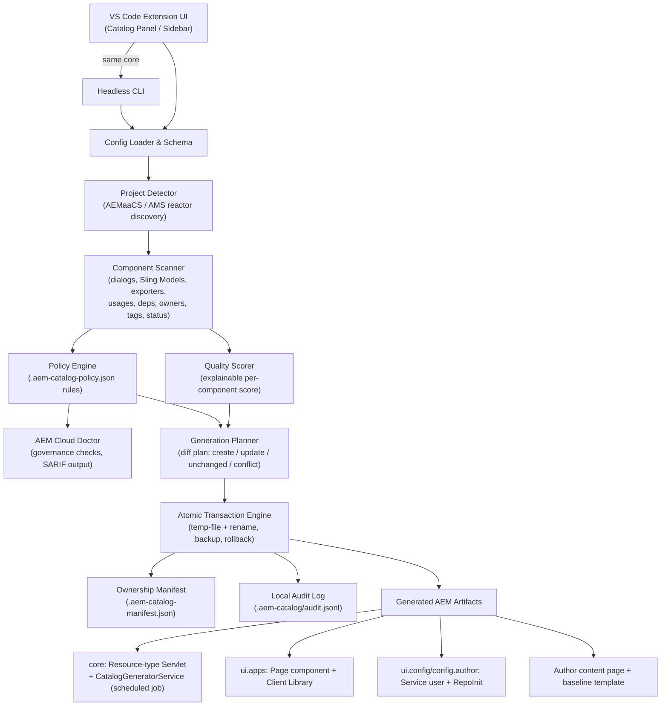
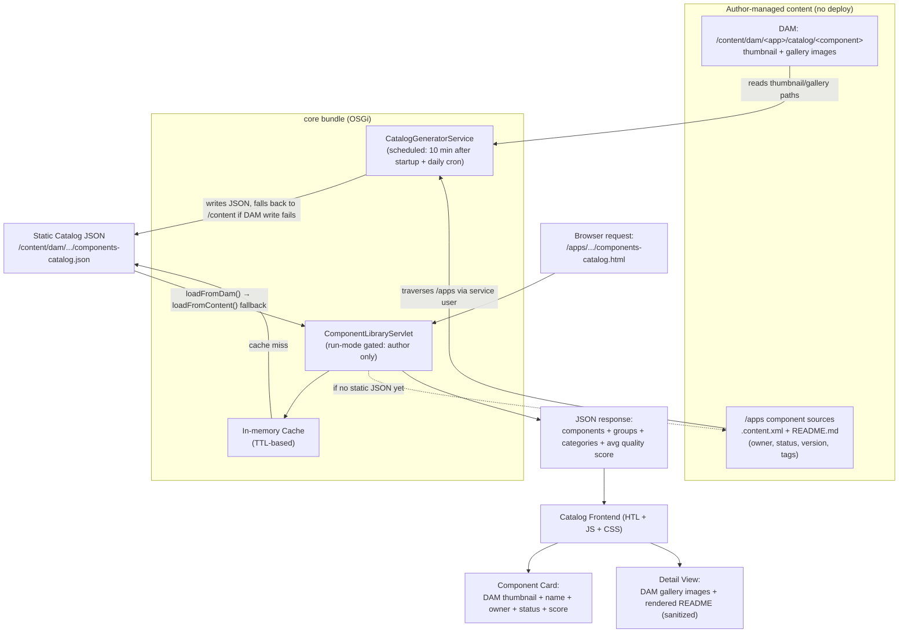

# AEM Component Catalog

Configure, generate, and deploy a browsable component showcase for **Adobe Experience Manager as a Cloud Service (AEMaaCS) and AEM as a Managed Service (AMS)**. Component discovery, governance, and safe generation tooling are available as advanced/optional features.

The project includes both a VS Code extension and the `aem-catalog` headless CLI. They use the same validation, policy, planning, and transaction engine, so local development and CI produce the same result.

## Enterprise capabilities

- AEMaaCS and AEM AMS project detection, with AEMaaCS-specific package-boundary validation
- AEM Cloud Doctor (AEMaaCS-specific) with organization policy packs and SARIF output
- Recursive component inventory with dialog fields, Sling Models, exporters, usages, dependencies, owners, versions, tags, and lifecycle status
- Explainable component quality score
- Complete generation plans with per-file diffs and conflict detection
- Atomic generation, manual-change preservation, rollback snapshots, and local audit records
- Author-only catalog provisioning through `ui.config/config.author`
- Cached servlet metadata with resource-change invalidation and pagination
- Strict VS Code webview CSP, allow-listed messages, path containment, and Workspace Trust support
- Sanitized README rendering and escaped generated content
- JSON, CSV, Markdown, and SARIF reports
- Redacted diagnostic support bundles and a checksummed template registry
- Cross-platform CI, dependency review, SBOM creation, VSIX packaging, and release provenance

## Requirements

- VS Code 1.100+
- Node.js 20+ for source development or CLI use
- An AEMaaCS or AEM AMS Maven reactor
- AEMaaCS: `core`, `ui.apps`, `ui.config`, `all`, plus Cloud SDK/Analyser markers; the current archetype `dispatcher` module (and legacy `dispatcher.cloud` name) is supported
- AMS: an `uber-jar`/`cq-quickstart` dependency with a Java module (`core` or `bundle`) and a content module (`ui.apps` or `content`)

AEM 6.5 and on-premise (non-Cloud, non-AMS) projects are intentionally unsupported. AEM Cloud Doctor's governance checks are AEMaaCS-specific.

## Quick start in VS Code

1. Open the AEMaaCS or AEM AMS reactor, or a workspace containing one or more reactors.
2. Run **AEM Component Catalog: Configure & Generate Micro-site** (or open the Catalog panel from the status bar / sidebar). It writes sensible defaults on first run — nothing to hand-edit.
3. Deploy to local AEM from the same panel, then open the generated catalog page on Author.
4. (AEMaaCS, advanced, optional) Add governance metadata to component definitions and run **AEM Component Catalog: (Advanced) Run AEM Cloud Doctor** for a portfolio-wide health check — this never blocks generation.
5. Use the **Audit** tab in the Catalog panel for a cross-project tech audit (classification, duplicates, usage, Excel export) across both platforms.

Generation is disabled in an untrusted workspace. The extension never silently overwrites manually changed files.

## CLI

```bash
npm ci
npm run compile

node out/cli.js init --project /path/to/aem-project --yes
node out/cli.js doctor --project /path/to/aem-project
node out/cli.js doctor --project /path/to/aem-project --format sarif --output doctor.sarif
node out/cli.js scan --project /path/to/aem-project --format csv --output components.csv
node out/cli.js plan --project /path/to/aem-project
node out/cli.js generate --project /path/to/aem-project --yes
node out/cli.js rollback --project /path/to/aem-project --yes
node out/cli.js support --project /path/to/aem-project --output support.json
```

`generate` refuses Cloud Doctor errors by default. `--force` is explicit and also permits overwriting conflicts; use it only after reviewing the plan.

## Governance metadata

Add these properties to each component `.content.xml`:

```xml
catalogOwner="design-system-team"
catalogStatus="active"
catalogVersion="2.1.0"
catalogTags="[commerce,shared]"
```

The property names are configurable. Default lifecycle statuses are `draft`, `active`, and `deprecated`.

## Organization policy

Init creates `.aem-catalog-policy.json`:

```json
{
  "schemaVersion": 1,
  "extends": ["recommended-aemaacs"],
  "rules": {
    "component.require-owner": "error",
    "component.require-readme": "error",
    "component.require-thumbnail": "warning"
  },
  "minimumQualityScore": 80,
  "allowedStatuses": ["draft", "active", "deprecated"]
}
```

Change the preset to `strict-aemaacs` when the organization is ready to promote recommended warnings to errors. See [Policy Reference](docs/POLICY_REFERENCE.md) for every built-in rule.

## Safe generation model

The engine renders the complete desired artifact set before writing anything. Every output is classified as `create`, `update`, `unchanged`, or `conflict`.

- Existing files without a matching ownership hash are conflicts.
- Safe generation preserves conflicts.
- Writes use a temporary sibling file and atomic rename.
- Existing contents and the ownership manifest are backed up before changes.
- Any failure rolls back files already written.
- `.aem-catalog/audit.jsonl` records hashes and outcomes without file content.
- **Roll Back Last Generation** restores the latest successful transaction.

The local `.aem-catalog/` state directory is ignored by Git. The portable ownership file `.aem-catalog-manifest.json` may be committed so every developer and CI agent shares drift detection.

## Generated AEMaaCS artifacts

- Resource-type servlet under `core`
- Page rendering component and client library under `ui.apps`
- Service-user mapping and RepoInit under `ui.config/.../config.author`
- Author content page and baseline template created by RepoInit

The runtime servlet checks the `author` run mode and returns `404` elsewhere. No Cloud Manager, RDE, AEM, or Adobe credentials are stored by the extension.

## Architecture and data flow

### Dev-time: configure → scan → generate



### Runtime: how the microsite serves data on AEM Author



Key properties: a single core shared by the extension and CLI, author-only servlet exposure, a nightly pre-computed JSON to avoid live `/apps` traversal at request time, author-managed images/READMEs decoupled from code deploys, and atomic/reversible generation. See [Architecture](docs/ARCHITECTURE.md) for module boundaries and extension points.

## Development

```bash
npm ci
npm run quality
npm run test:coverage
npm run test:integration
npm run compile
npm run package:vsix
```

Architecture and extension points are documented in [Architecture](docs/ARCHITECTURE.md). Operational rollout guidance is in [Enterprise Operations](docs/ENTERPRISE_OPERATIONS.md).

## Build and package the extension

```bash
npm ci               # install dependencies
npm run compile       # type-check + bundle (out/extension.js, out/cli.js)
npm run package:vsix   # produces the installable .vsix
```

`package:vsix` runs `vsce package`, which re-runs `compile` via `vscode:prepublish` and writes the VSIX to the project root:

```text
aem-component-library-generator-<version>.vsix
```

For example, version `2.1.0` produces `aem-component-library-generator-2.1.0.vsix` in the repository root. Install it locally with:

```bash
code --install-extension aem-component-library-generator-2.1.0.vsix
```

Or, in VS Code: **Extensions view → `···` menu → Install from VSIX…**.

## Security and privacy

The extension does not collect telemetry. Support bundles are generated locally and redact project-root paths and secret-like configuration keys. Review [SECURITY.md](SECURITY.md) before reporting a vulnerability.

Licensed under the [MIT License](LICENSE).
