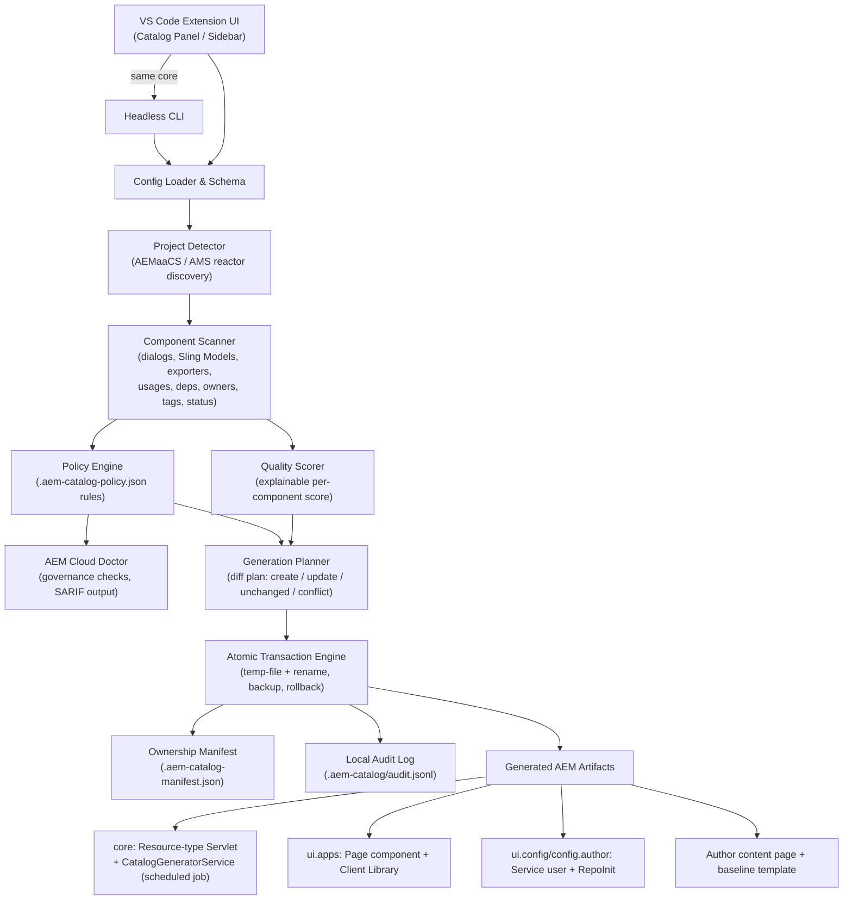
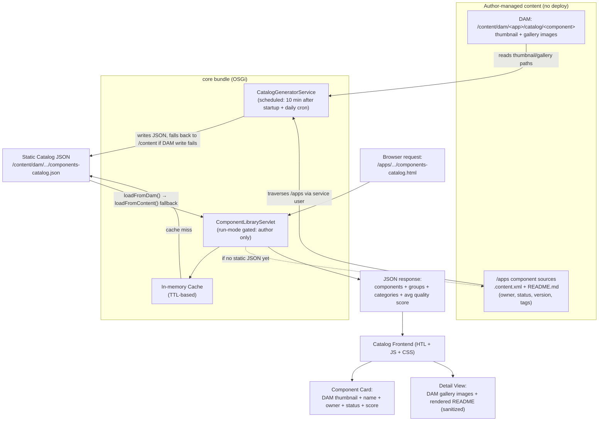

# Supporting Stack & Architecture

## Design goal

The extension is a thin VS Code adapter around a deterministic core. AEM project data is a local input; no remote service or credential is required to run it.

```text
VS Code commands/dashboard ─┐
                           ├─> configuration + AEMaaCS discovery
Headless CLI ──────────────┘              │
                                          ├─> component scanner + quality
                                          ├─> Cloud Doctor + policy + SARIF
                                          └─> generation planner
                                                   │
                                                   └─> atomic transaction + manifest + audit
```

Both entry points — the VS Code commands/dashboard and the headless CLI — call into the same core functions, which is what guarantees a local run and a CI run produce the same result.

## Dev-time data flow: configure → scan → generate



## Runtime data flow: how the microsite serves data on AEM Author



## Technology stack

| Layer | Technology |
| --- | --- |
| Language | TypeScript 5.9 (`strict` project config, `tsc --noEmit` as a dedicated `check` script) |
| Extension host | VS Code Extension API `^1.100.0`, `workspace` extension kind |
| Bundler | esbuild (`esbuild.mjs`), including a `--watch` dev mode |
| CLI | Node.js 20+, packaged as the `aem-catalog` binary (`out/cli.js`) |
| Templating | Handlebars — renders the generated Java, HTL, clientlib, and OSGi artifacts |
| XML parsing | fast-xml-parser — reads JCR `.content.xml` sources during scanning |
| Reporting | ExcelJS (Tech Audit `.xlsx` output), native JSON/CSV/Markdown/SARIF writers |
| Packaging | adm-zip (VSIX/zip handling), `@vscode/vsce` (VSIX packaging) |
| Testing | Vitest (unit + coverage via `@vitest/coverage-v8`), `@vscode/test-electron` (integration tests against a real VS Code instance) |
| Linting/formatting | ESLint 9 + typescript-eslint, Prettier |
| Supply chain | `npm sbom --sbom-format cyclonedx`, GitHub release provenance |

No AEM, Cloud Manager, RDE, or Adobe credentials are stored or required by the extension — it operates entirely on the local Maven reactor's source files.

## Module boundaries

| Path | Responsibility |
| --- | --- |
| `src/core` | Policy, quality scoring, Cloud Doctor, SARIF output, generation plans, transactions, template registry, and supportability (support bundles) |
| `src/scanner` | Maven and JCR source discovery |
| `src/generators` | Pure artifact recipes — computes desired file content, performs **no file writes** itself |
| `src/config` | Versioned configuration schema, migration (v1 → v2), defaults, and validation |
| `src/audit` | The separate Tech Audit Report engine: component classification, content-package parsing, duplicate detection, Excel reporting |
| `src/commands`, `src/sidebar`, `src/webview` | VS Code adapters — commands, tree views, and the dashboard/config-panel/audit-panel webviews |
| `src/cli.ts` | The headless CLI adapter |
| `src/templates` | The generated AEM Java, HTL, clientlib, and OSGi artifact templates |

## Invariants the engine holds

1. Only positively identified AEMaaCS reactors are accepted.
2. Generated paths must remain inside the selected reactor.
3. Recipes render every desired artifact before any writes begin.
4. Existing content is changed only when the ownership manifest proves the tool owns it, or the operator explicitly forces it.
5. A failed transaction restores every file already touched.
6. The VS Code webview never supplies a filesystem path to a privileged handler.
7. The generated runtime catalog servlet is author-only, even if its content is accidentally copied elsewhere.
8. CLI and VS Code behavior share the same core functions — no separate code path to drift out of sync.

## Extension points

- **New Cloud Doctor rule** — add it in `core/doctor.ts` plus a default severity in `core/policy.ts`.
- **New scanned metadata** — add it in `scanner/componentScanner.ts`, then surface it through Doctor, the CLI, and the dashboard.
- **New generated artifact** — add a recipe that returns a `GeneratedArtifact` and register it in `buildGenerationPlan`.
- **Template changes** — require a golden generation test; the template registry's checksum makes template-set drift visible.

## Persisted state

| File/directory | Nature |
| --- | --- |
| `.component-library.json` | Committed desired configuration (schema v2) |
| `.aem-catalog-policy.json` | Committed organization policy |
| `.aem-catalog-manifest.json` | Portable ownership state — recommended to commit so every developer and CI agent shares drift detection |
| `.aem-catalog/` | **Not committed** (Git-ignored) — local backups, generation lock, and audit history |

Next: the [Usage Manual](./usage-manual/getting-started).
