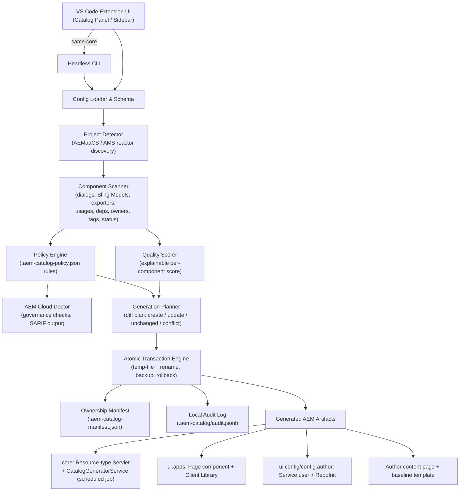
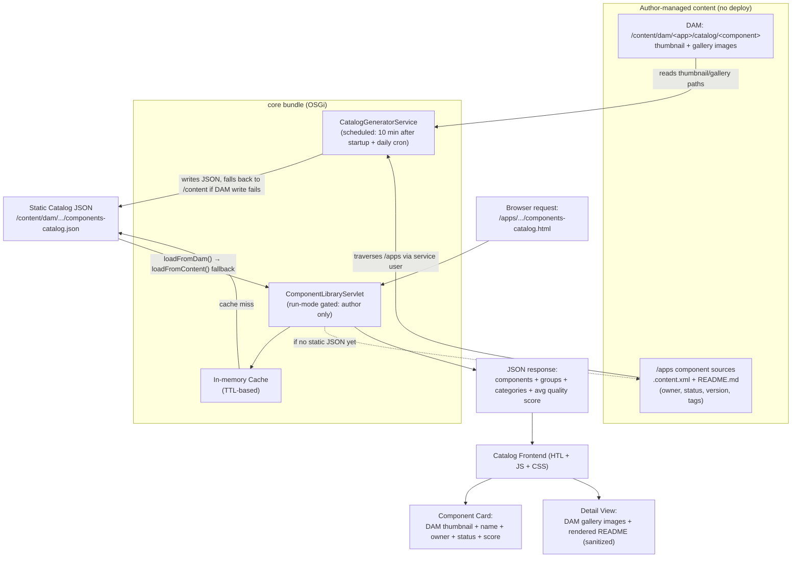

# Architecture

## Design goals

The extension is a thin VS Code adapter around a deterministic core. AEM project data is local input; no remote service or credential is required.

```text
VS Code commands/dashboard ─┐
                           ├─> configuration + AEMaaCS discovery
Headless CLI ──────────────┘              │
                                          ├─> component scanner + quality
                                          ├─> Cloud Doctor + policy + SARIF
                                          └─> generation planner
                                                   │
                                                   └─> atomic transaction + manifest + audit
```

## Dev-time data flow: configure → scan → generate



## Runtime data flow: how the microsite serves data on AEM Author



## Boundaries

- `src/core`: policy, quality, Doctor, SARIF, plans, transactions, templates, and supportability
- `src/scanner`: Maven and JCR source discovery
- `src/generators`: pure artifact recipes; no file writes
- `src/config`: versioned schema, migration, defaults, and validation
- `src/commands`, `src/sidebar`, `src/webview`: VS Code adapters
- `src/cli.ts`: headless adapter
- `src/templates`: generated AEM Java, HTL, clientlib, and OSGi artifacts

## Invariants

1. Only positively identified AEMaaCS reactors are accepted.
2. Generated paths must remain inside the selected reactor.
3. Recipes render every desired artifact before writes begin.
4. Existing content is changed only when the manifest proves ownership or the operator explicitly forces it.
5. A failed transaction restores every file already touched.
6. The VS Code webview never supplies a filesystem path to privileged handlers.
7. The runtime catalog is author-only even if content is accidentally copied elsewhere.
8. CLI and VS Code behavior share the same core functions.

## Extension points

- Add a rule in `core/doctor.ts` and a default level in `core/policy.ts`.
- Add metadata in `scanner/componentScanner.ts`, then expose it through Doctor, CLI, and dashboard.
- Add an artifact recipe that returns `GeneratedArtifact`; include it in `buildGenerationPlan`.
- Change a template only with a golden generation test. The registry digest makes template-set drift visible.

## State

- `.component-library.json`: committed desired configuration
- `.aem-catalog-policy.json`: committed organization policy
- `.aem-catalog-manifest.json`: portable ownership state; recommended to commit
- `.aem-catalog/`: ignored local backups and audit history
